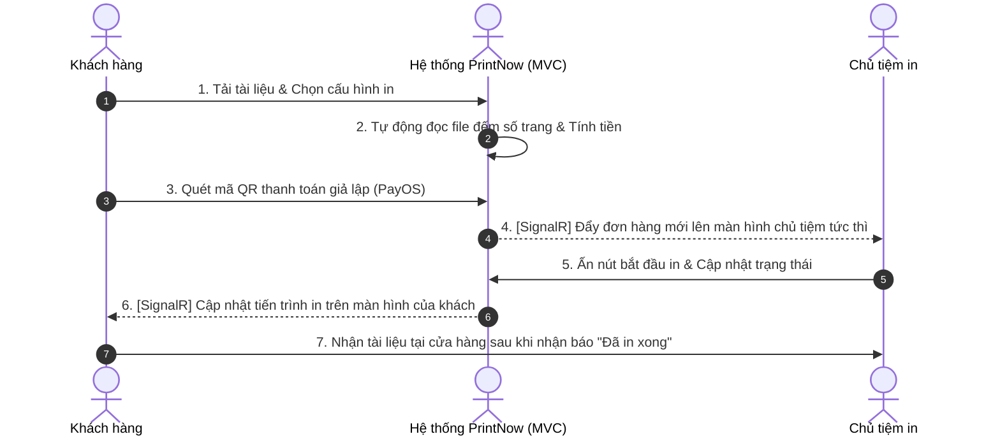

# PrintNow - Ứng dụng đặt in trực tuyến (Đồ án Môn học TMĐT)

**PrintNow** là hệ thống hỗ trợ kết nối khách hàng (học sinh, sinh viên, người đi làm) với các cửa hàng in ấn xung quanh. Khách hàng có thể tự tải tài liệu lên, cấu hình in, xem báo giá tự động, thanh toán trực tuyến và đến nhận tài liệu ngay khi có thông báo in xong mà không cần xếp hàng chờ đợi.

Dự án này được thiết kế tối ưu phục vụ cho mục tiêu **Đồ án môn học Thương mại điện tử**, sử dụng kiến trúc nguyên khối (Monolith) với **ASP.NET Core MVC (Razor)** để dễ dàng phát triển và quản lý.

---

## 1. Vai trò trong hệ thống & Luồng hoạt động cốt lõi

Hệ thống phân tách rõ ràng thành 2 vai trò chính:

### 👤 Khách hàng (Customer)
*   **Tìm tiệm in**: Định vị và xem danh sách các tiệm in xung quanh, xem bảng giá chi tiết của từng tiệm và đánh giá của các khách hàng cũ.
*   **Cấu hình đơn in**: Tải file lên (`.pdf`, `.docx`), chọn khổ giấy (A3/A4), kiểu in (1 mặt/2 mặt, màu/trắng đen), số lượng bản và dịch vụ gia công.
*   **Báo giá tự động**: Hệ thống tự đếm số trang file đã tải lên và tính tiền tự động theo bảng giá của tiệm.
*   **Thanh toán giả lập**: Thanh toán qua cổng giả lập (PayOS) để hoàn tất đơn hàng.
*   **Theo dõi thời gian thực**: Theo dõi tiến độ in tài liệu qua sơ đồ trạng thái cập nhật tự động.
*   **AI Chatbot**: Nhắn tin với trợ lý ảo để nhờ tư vấn cấu hình in phù hợp.

### 🏪 Chủ tiệm in (Shop Owner)
*   **Dashboard tổng quan**: Xem thống kê số lượng đơn mới, đơn đang xử lý và tổng doanh thu ước tính trong ngày.
*   **Quản lý đơn hàng**: Nhận thông tin chi tiết đơn in, tải file của khách hàng về máy in để thực hiện.
*   **Cập nhật tiến độ**: Chuyển trạng thái đơn in để thông báo lập tức cho khách hàng.
*   **Quản lý bảng giá**: Điều chỉnh linh hoạt đơn giá của từng dịch vụ.

---

## 2. Quy trình xử lý đơn hàng (Workflow)



---

## 3. Kiến trúc Công nghệ chốt sử dụng

Hệ thống được phát triển theo mô hình MVC, sử dụng toàn bộ hệ sinh thái của .NET:

*   **Framework**: **ASP.NET Core MVC (.NET 8)**
*   **Giao diện (Frontend)**: **Razor Views (`.cshtml`) + Bootstrap 5 / TailwindCSS**
    *   Tạo giao diện nhanh chóng, có thể tích hợp thư viện JS trực tiếp.
*   **Cơ sở dữ liệu**: **SQL Server Express**
    *   Sử dụng **Entity Framework Core (Code-First)** để quản lý database.
*   **Real-time**: **SignalR**
    *   Đẩy dữ liệu trạng thái đơn hàng thời gian thực giữa Khách và Chủ tiệm.
*   **Lưu trữ tài liệu in**: **Local Disk Storage**
    *   Các file tải lên sẽ được lưu trực tiếp vào thư mục `wwwroot/uploads`.
*   **Mở cổng kết nối Internet**: **ngrok**
    *   Nhận Webhook từ cổng thanh toán về máy tính đang chạy Local.
*   **Xử lý tệp tin**: **PDFsharp & NPOI**
    *   Thư viện C# hỗ trợ tự động đếm trang file PDF và file Word.
*   **Thanh toán & AI**: **PayOS Sandbox** & **Google Gemini API**.

---

## 4. Cấu trúc thư mục dự án

```text
PrintNow/
├── PrintNow.sln
└── PrintNow.Web/               # Mã nguồn ASP.NET Core MVC
    ├── Controllers/            # Xử lý điều hướng (Home, Order, Shop, Auth...)
    ├── Views/                  # Chứa giao diện Razor (.cshtml)
    ├── Models/                 # Lớp thực thể dữ liệu (Entity classes)
    ├── Services/               # Xử lý Logic (Đếm trang, AI, Thanh toán)
    ├── Hubs/                   # SignalR Hubs để giao tiếp real-time
    ├── wwwroot/                # Chứa file tĩnh (css, js, images)
    │   └── uploads/            # Thư mục lưu file tài liệu khách hàng
    ├── appsettings.json        # Chuỗi kết nối DB và API Keys
    └── Program.cs
```
